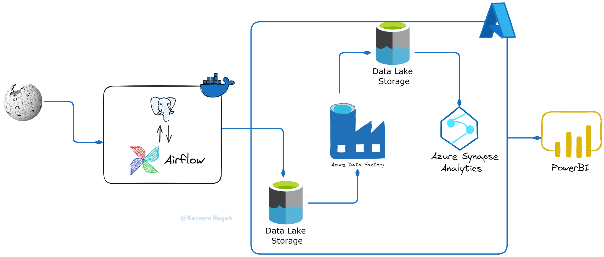

# 🏟️ E2E Football Stadiums Data Pipeline

An end-to-end data engineering pipeline that extracts, transforms, enriches, and analyzes football stadium data from Wikipedia. This project utilizes web scraping, data transformation, geocoding, cloud storage, and data warehousing to enable robust analytics and reporting using Azure Synapse and Power BI.

---

## 🚀 Project Architecture



This pipeline is orchestrated using Apache Airflow and includes the following stages:

1. **Extraction**: Scrapes football stadium data from Wikipedia.
2. **Transformation**: Cleans and enriches the data using Pandas.
3. **Geocoding**: Retrieves latitude and longitude for stadiums using external geocoding services.
4. **Storage**: Uploads cleaned data to Azure Blob Storage.
5. **Data Factory & Synapse**: Processes data through Azure Data Factory into Azure Synapse for further analytics.
6. **Visualization**: Generates insightful dashboards using Power BI.

---

## 📊 Workflow Diagram


---

## 🛠️ Tools & Technologies

* **Airflow** – Orchestration and scheduling
* **Docker** – Containerized pipeline deployment
* **Python** – Data extraction and transformation (Pandas, Requests, LXML)
* **PostgreSQL** – Metadata and logging support
* **Geocoding API** – Enrichment with coordinates
* **Azure Blob Storage** – Intermediate and final storage
* **Azure Data Factory** – ETL pipeline automation
* **Azure Synapse Analytics** – Data warehousing and processing
* **Power BI** – Dashboard and reporting

---

## 📂 Project Structure

```
├── docker-compose.yml
├── Dockerfile
├── LICENCE
├── README.md
├── dags
│   ├── __init__.py
│   └── wikipedia_flow.py
├── data/
├── logs
├── pipeline_testing.ipynb
├── pipelines
│   ├── __init__.py
│   ├── geocoding.py
│   └── wikipedia_pipeline.py
├── postgres_data 
└── requirements.txt
```

---

## 📊 Dashboard Example

* Cleaned and geocoded data are aggregated and visualized in Power BI.
* Dashboards may include:

  * Stadium distribution by country
  * Capacity-based insights
  * Regional mapping using coordinates

---

## 🧪 How to Run

### 1. Clone the repo

```bash
git clone https://github.com/kareemNagah/E2E_FootBall_Stadiums_Pipeline.git
cd E2E_FootBall_Stadiums_Pipeline
```

### 2. Run Airflow using Docker

```bash
docker-compose up -d --build
```

### 3. Access Airflow UI

Go to `http://localhost:8080` and trigger the DAG: `wikipedia_stadiums_pipeline`.

---

## 🤝 Credits

Created by [Kareem Nagah](https://www.linkedin.com/in/kareem-nagah-81328022a/)

---

## 📄 License

This project is licensed under the MIT License.
